# GradatiON

A personal Android client for language models: chat, roleplay with your own characters, and
a remote for the coding agents running on your computers. Everything sits under one quiet
monochrome interface made of iOS-style Liquid Glass. Fork of
[oxproxion](https://github.com/stardomains3/oxproxion).

| | |
|--|--|
| **Version** | 3.0.0 |
| **Package** | `io.github.warexpor.gradation` |
| **Android** | 12+ (min SDK 31, target 36) |
| **License** | Apache 2.0 |

Not affiliated with xAI, Anthropic, OpenAI or OpenRouter.

## Screenshots

| Chat | Reply menu | History |
|------|------------|---------|
| 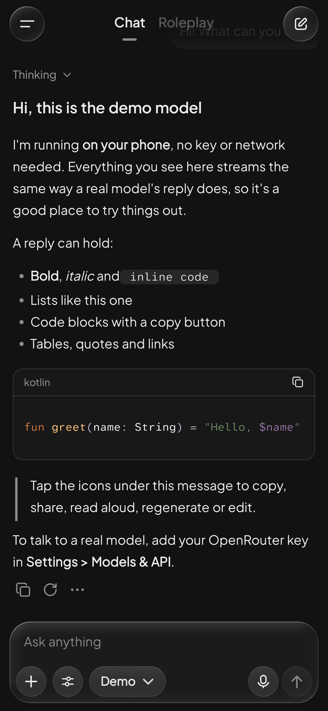 | 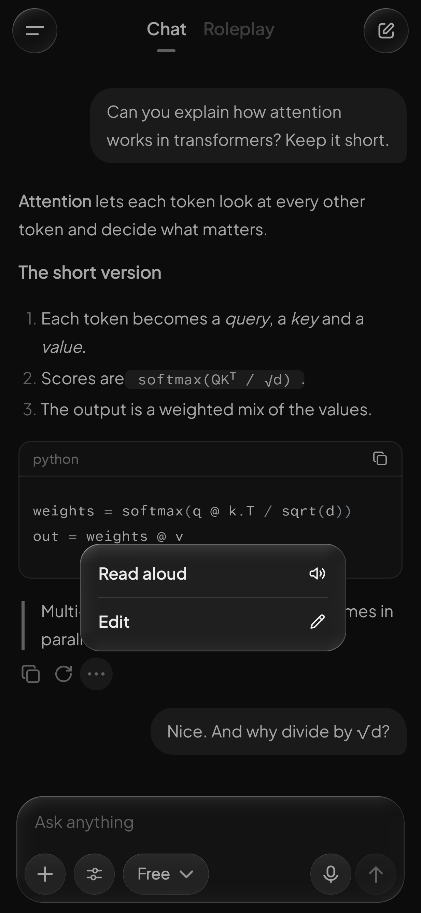 | 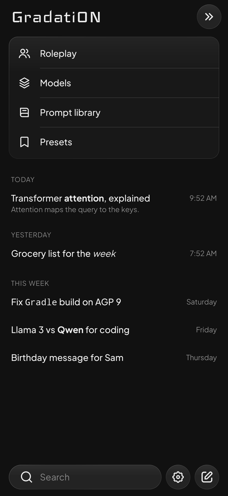 |

| Characters | Roleplay | Character panel |
|------------|----------|-----------------|
| 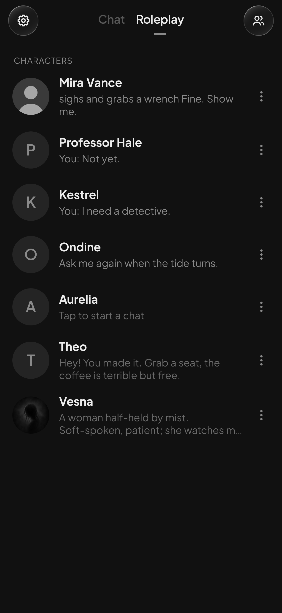 | 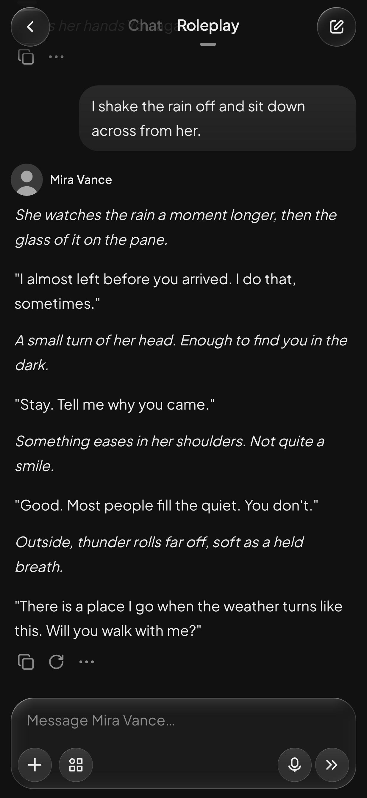 | 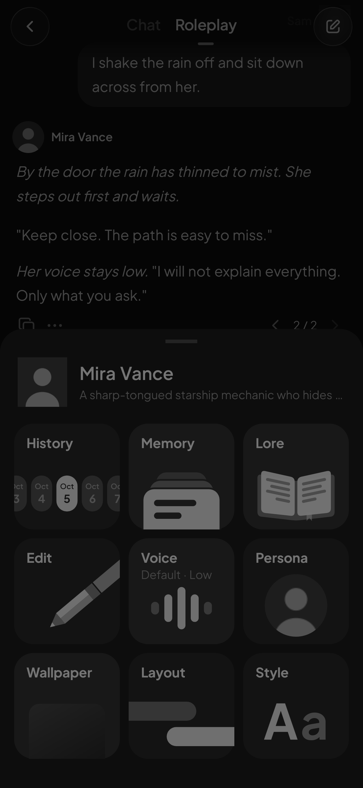 |

| Code | Code session | Voice input |
|------|--------------|-------------|
| 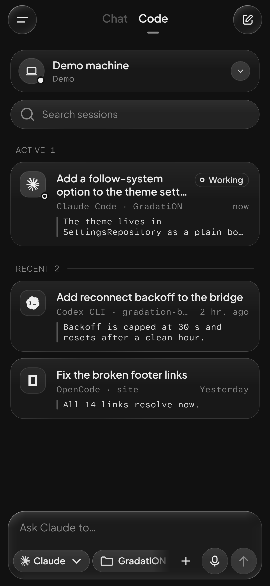 | 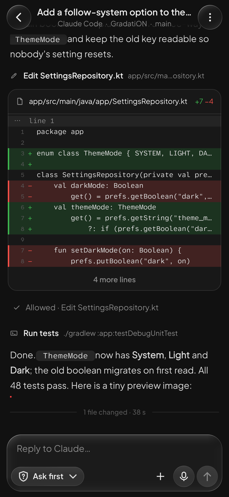 | 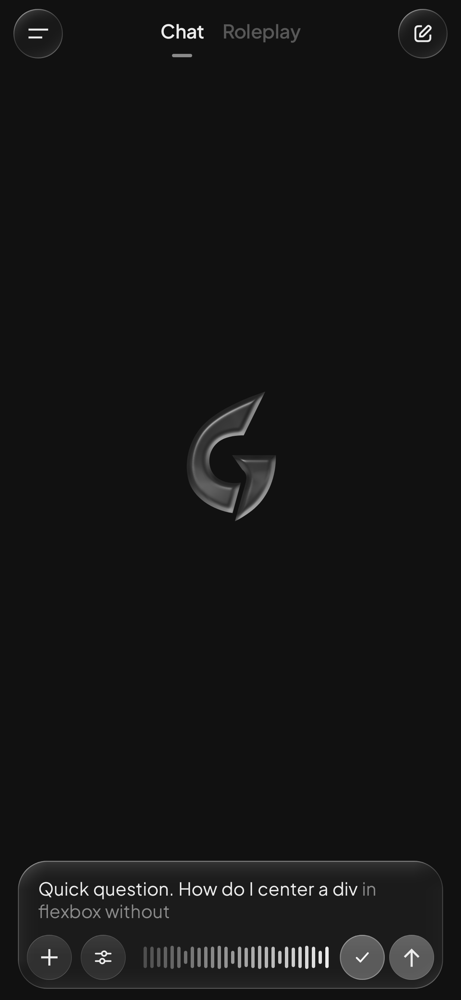 |

| Appearance | Bubbles layout | Controls |
|------------|----------------|----------|
| 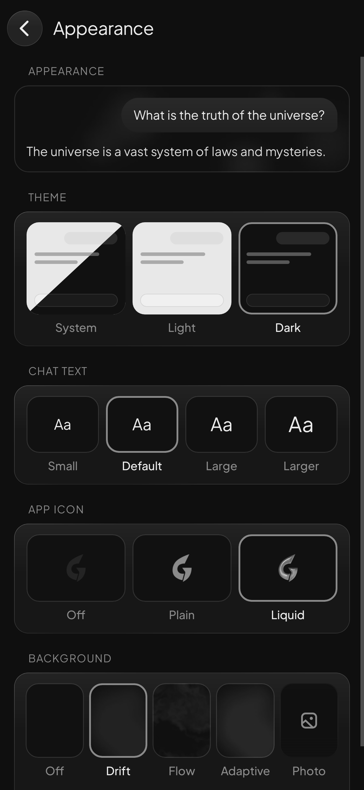 | 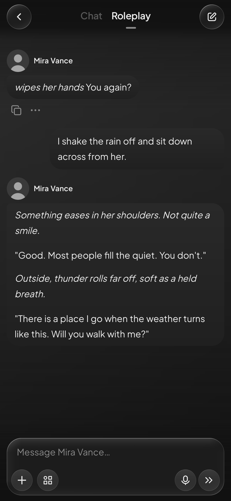 | 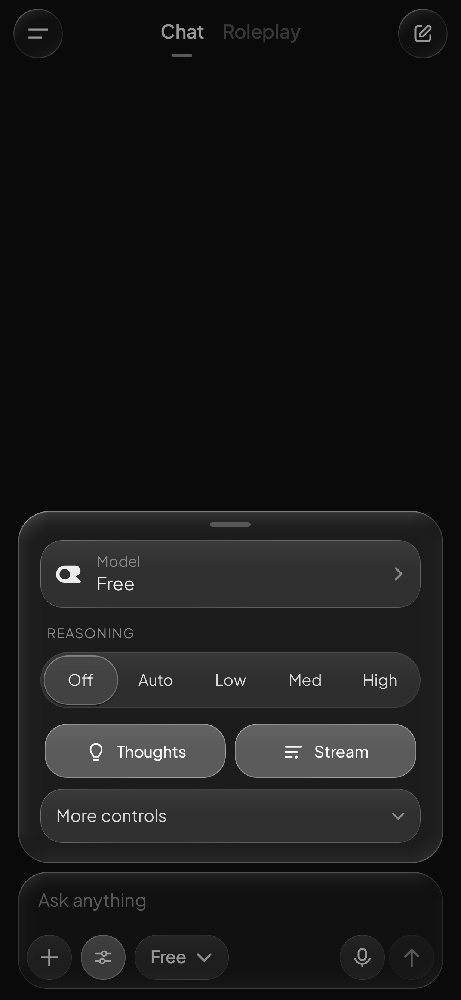 |

Screenshots come from the Robolectric tests (`ScreenshotTest`, `RpScreenshotTest`, `CodeModeScreenshotTest`), so
they always match the code.

## Install

Grab the signed APK from the [releases page](https://github.com/Warexpor/GradatiON/releases) and
open it. Every release is signed with the same key, so updates install over it and keep your chats. Check
a download against the `.sha256` next to it.
Dev builds (`assembleDev`) are a separate app and never update a release.

## Three modes

Swipe or tap the tabs at the top to move between them.

**Chat.** Streaming replies with markdown, code blocks, tables and reasoning. It also covers
vision, image generation, web search, system prompts, presets and tool calling (off by
default). Edit, resend or delete a message and the chat forks, with a navigator for the
branches. Chats save automatically to History, where you can pin, rename, search and export.

**Roleplay** (opt-in in Settings > Modes). Build your own characters, personas and lorebooks.
- The tab opens on a list of your characters, the ones you are mid-story with first. Tap one
  and its chat slides in over the list; the back arrow slides it away again.
- Tap the character's name to open a panel with History, Memory, Lore, Edit, Voice, Persona,
  Wallpaper, Layout and Style. Memory holds facts the character keeps true for the rest of
  the story; History lists that character's past chats.
- On an empty composer the send button becomes Continue: the character takes the next beat
  without you having to write anything.
- Swipe for alternate replies. Imported cards can use `{{char}}` and `{{user}}`.

**Code.** Pair your computers and drive Claude Code, Codex, OpenCode and other agents from your
phone. The transcript is one quiet line per tool call, with a Thinking view that opens every
thought and output. You approve edits from the phone, see colored diffs, and get a notification
when an agent needs you.

**Voice input** works in every composer. Tap the mic, talk, and tap the check when you're done.
The words land in the field and never send themselves. It uses the phone's own recognizer
(on-device first), and falls back to an OpenRouter or local transcription model.

**Demo model.** "GradatiON: Demo" runs on the phone with no key or network. Pick it to try the
app before you add a key.

## Backends

| Backend | Transport | Notes |
|---------|-----------|-------|
| [OpenRouter](https://openrouter.ai/) | HTTPS | API key and credits |
| Ollama, LM Studio, llama.cpp, MLX LM, oMLX, Nativ, Hermes Agent | LAN HTTP(S) | You host the server |

- Plain HTTP only works for private, loopback, link-local and `.local` hosts. HTTPS works for any host.
- To use a self-signed certificate on the LAN, turn on Settings > Models & API > Trust self-signed certificates.

## Build

```bash
git clone https://github.com/Warexpor/GradatiON.git
cd GradatiON
./gradlew assembleDev          # installs next to the release app as io.github.warexpor.gradation.dev
./gradlew testDebugUnitTest    # logic tests, ~20 s; add -Pfull for the screenshot classes (app/build/screenshots)
```

You need JDK 17 and the Android SDK, with platform `android-37.0` and build-tools 36.0.0 (okhttp
5.5 requires compileSdk 37). Dev builds are minified with R8 and signed with the dev key in the
repo. Versions are in `app/build.gradle.kts` and [`CHANGELOG.md`](CHANGELOG.md). Releases are built
with `scripts/release.sh`; see [`docs/RELEASING.md`](docs/RELEASING.md).

## Docs

- [`DESIGN.md`](DESIGN.md): the design contract. Palette, glass, type, motion, components.
- [`AGENTS.md`](AGENTS.md): code map and how to work in this repo, for people and coding agents.
- [`docs/RELEASING.md`](docs/RELEASING.md): how a release is built, signed and kept updatable.
- [`docs/backlog.md`](docs/backlog.md): what's done and what's next.

## Privacy

- Chats stay on the device. The database is encrypted with SQLCipher and API keys are wrapped
  by the Keystore.
- Cloud backup leaves out preferences and the chat database. There are no trackers or ads.
- Cloud traffic falls under the policies of OpenRouter and each provider. LAN HTTP is
  unencrypted unless you use HTTPS.
- Roleplay is 18+. The app is provided as is, with no warranty.
